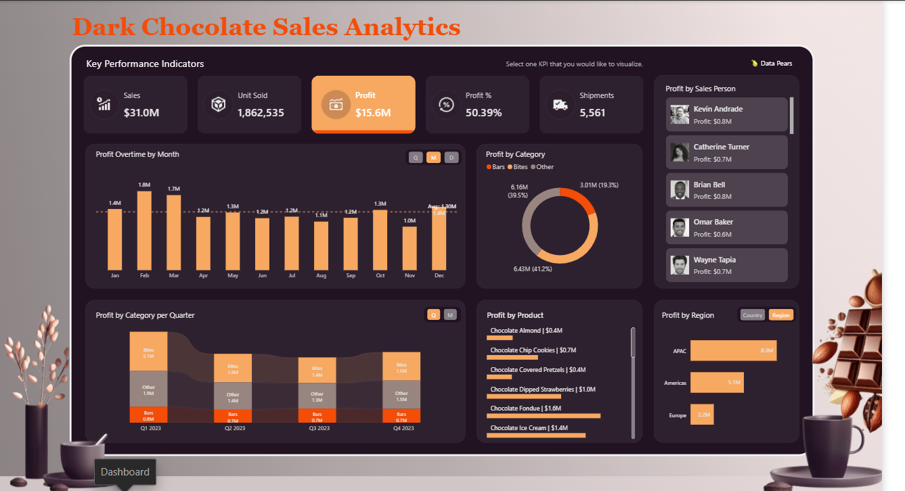
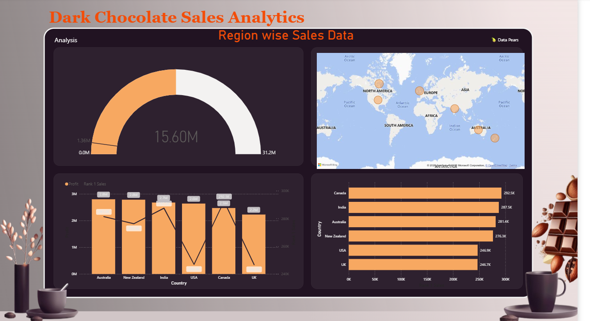
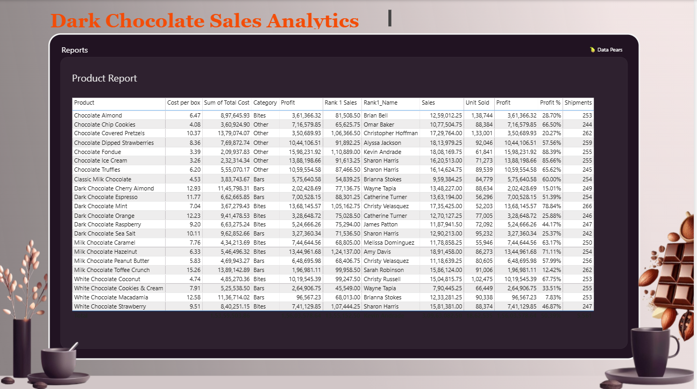

# 🍫 Dark Chocolate Sales Analytics – Power BI Dashboard

## 📊 Project Overview

This is my **2nd Power BI project**, created to analyze chocolate sales performance and turn sales data into clear, interactive business insights.

The dashboard focuses on **sales, profit, shipments, products, categories, regions, countries, sales representatives, and time-based performance**.

The project was designed with an interactive and business-friendly layout so users can explore the data using filters and visualizations.

---

## 🎯 Project Objectives

- Analyze overall chocolate sales performance
- Track **Sales, Profit, Profit %, Units Sold, and Shipments**
- Identify the best-performing products
- Compare profitability across regions and countries
- Analyze category-level performance
- Understand monthly and quarterly trends
- Compare sales performance by sales person/team
- Provide a detailed product-level report
- Create an interactive dashboard for business decision-making

---

## 🛠️ Tools & Technologies

- **Microsoft Power BI**
- **Power Query** – Data preparation and transformation
- **DAX** – Measures and business calculations
- **Data Modeling** – Relationships and analytical model
- **Interactive Slicers & Filters**
- **Power BI Visualizations**

---

## 📁 Dashboard Pages

### 1. Dashboard

The main dashboard provides a high-level view of chocolate sales performance.

Key analysis includes:

- Profit by month
- Profit by region
- Profit by product
- Profit by chocolate category
- Profit by quarter/year
- Sales person filtering
- Period filtering
- Region and country filtering
- Metric selection

**Categories analyzed:**
- Bars
- Bites
- Other

---

### 2. Analysis

The Analysis page provides deeper business insights using:

- Profit by country
- Top-performing sales/products
- Country-level geographic analysis
- Profit percentage
- Rank-based sales analysis
- Sales vs. profit comparison

This page helps identify where sales and profitability are strongest.

---

### 3. Reports

The Reports page provides a detailed product-level view with fields such as:

- Product
- Category
- Cost per Box
- Total Cost
- Sales
- Units Sold
- Profit
- Profit %
- Shipments
- Ranking information

The report can be filtered interactively to investigate individual products and performance.

---

## 📈 Key Metrics

The dashboard includes measures such as:

| Metric | Description |
|---|---|
| **Sales** | Total sales generated |
| **Profit** | Total profit generated |
| **Profit %** | Profitability percentage |
| **Units Sold** | Total number of units sold |
| **Shipments** | Total shipment count |
| **Rank 1 Sales** | Highest-ranked sales value |
| **Rank 2 Sales** | Second-ranked sales value |
| **Rank1 Name** | Name associated with the top-ranked result |

---

## 📊 Visualizations Used

The project demonstrates the use of multiple Power BI visuals, including:

- Clustered bar charts
- Clustered column charts
- Ribbon charts
- Donut charts
- Line & stacked column charts
- Gauge
- Map
- Tables
- Slicers
- Interactive buttons

---

## 🔍 Interactive Features

Users can explore the report using filters for:

- Sales Person
- Period
- Metrics
- Quarter / Month
- Region / Country

The visuals are connected through interactive filtering, allowing users to select a category, region, product, or other dimension and see the related results across the dashboard.

---

## 🧮 Data Model

The report uses analytical entities including:

- `products`
- `shipments`
- `locations`
- `people`
- `Calendar`
- `Period`
- `Quarter-Month`
- `Region-Country`
- `Metrics`
- `_Measures`

The model supports calculations for sales, profit, profitability, units, shipments, and ranking.

---

## 💡 Business Insights

This dashboard can help answer questions such as:

- Which products generate the highest profit?
- Which countries perform best?
- Which regions are the most profitable?
- Which chocolate category contributes the most profit?
- How does profit change over time?
- Which sales representatives or teams are performing strongly?
- Which products have high sales but comparatively lower profitability?
- How are shipments and units sold distributed across products?

---

## 🚀 Learning Outcomes

Through this project, I practiced:

- Building interactive Power BI dashboards
- Data modeling
- Creating DAX measures
- Using slicers and cross-filtering
- Designing business-focused reports
- Using ranking calculations
- Combining multiple visual types
- Presenting data in a clean and professional format
- Turning raw sales data into actionable insights

---

## 📂 Project File

The main Power BI file is:

`Chocolate Sales Dashboard.pbix`

Open the file using **Microsoft Power BI Desktop** to explore the complete interactive dashboard.

---

## 🖼️ Dashboard Pages

The project contains three report pages:

**Dashboard → Analysis → Reports**







Example:

```text
screenshots/
├── dashboard.png
├── analysis.png
└── reports.png
```

---

## 📌 Project Status

**Completed – Power BI Portfolio Project #2**

This project is part of my Power BI learning and portfolio journey, with a focus on developing practical data analytics and dashboard development skills.

---

## 👨‍💻 Author

**T S Manikandan**

Power BI | SQL | Excel | Data Analytics

---

⭐ If you find this project useful, feel free to explore the dashboard and share your feedback.
